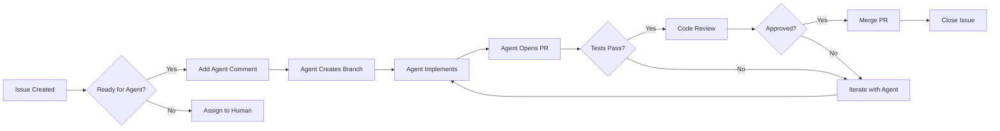

# Deploying Copilot Agents to Work on GitHub Issues

## 🎯 Overview

There are multiple ways to assign GitHub Copilot coding agents to work on issues. Each method has different use cases and levels of automation.

---

## 🚀 Method 1: Direct Issue Assignment (Recommended)

### Using GitHub Issues with `#github-pull-request_copilot-coding-agent`

The most effective way is to **mention the agent directly in an issue comment**:

### Steps:
1. Open any issue (e.g., Issue #10 - CSS Variables)
2. Add a comment with the agent hashtag:
   ```
   #github-pull-request_copilot-coding-agent please implement this issue
   ```
3. The agent will:
   - Create a new branch
   - Implement the changes
   - Open a pull request
   - Reference the original issue

### Example Comment:
```markdown
@github-copilot #github-pull-request_copilot-coding-agent 

Please implement this issue following the acceptance criteria and code examples provided. 
Make sure to:
- Use CSS variables from the design system
- Test all functionality per the checklist
- Ensure WCAG AA accessibility compliance
```

### Advantages:
- ✅ Most direct and reliable
- ✅ Agent gets full issue context automatically
- ✅ Creates PR linked to issue
- ✅ Can review and iterate on PR
- ✅ Works with existing GitHub workflow

---

## 🔄 Method 2: Batch Scheduling with GitHub Actions

### Automate Agent Deployment for Multiple Issues

Create a GitHub Action workflow to schedule agent work:

```yaml
# .github/workflows/copilot-agent-scheduler.yml
name: Copilot Agent Scheduler

on:
  schedule:
    # Run daily at 9am UTC
    - cron: '0 9 * * *'
  workflow_dispatch:  # Manual trigger

jobs:
  assign-agent:
    runs-on: ubuntu-latest
    steps:
      - uses: actions/checkout@v4
      
      - name: Assign Copilot Agent to Priority Issues
        env:
          GH_TOKEN: ${{ secrets.GITHUB_TOKEN }}
        run: |
          # Get all P0-Critical issues not assigned to agent
          gh issue list --label "P0-Critical" --json number,title,assignees \
            --jq '.[] | select(.assignees | length == 0) | .number' | \
          while read issue_num; do
            echo "Assigning agent to issue #$issue_num"
            gh issue comment $issue_num --body "#github-pull-request_copilot-coding-agent please implement this issue following all acceptance criteria and code examples provided."
          done
```

### Advantages:
- ✅ Automates agent assignment
- ✅ Can prioritize by labels
- ✅ Scheduled or manual trigger
- ✅ Processes multiple issues

---

## 📋 Method 3: Project Board Automation

### Using GitHub Projects with Automation

Set up automation rules in your GitHub Project:

1. **Create Project Board Automation:**
   - Go to your project board
   - Settings → Workflows
   - Add automation: "When issue moved to 'Ready for Agent'"
   - Action: Add comment with agent hashtag

2. **Example Automation Rule:**
   ```
   Trigger: Item moved to column "Ready for Agent"
   Action: Comment on issue with "@github-copilot #github-pull-request_copilot-coding-agent"
   ```

3. **Workflow:**
   - Drag issue to "Ready for Agent" column
   - Automation triggers agent
   - Agent creates PR
   - Move PR to "In Review" when ready

### Advantages:
- ✅ Visual workflow management
- ✅ Clear status tracking
- ✅ Team coordination
- ✅ Drag-and-drop simplicity

---

## 🎯 Method 4: Priority Queue System

### Create a Smart Queue for Agent Work

Create a priority-based assignment system:

```bash
#!/bin/bash
# assign-agents.sh - Smart agent assignment script

REPO="Thelastlineofcode/Astrology-Synthesis"

echo "🤖 Copilot Agent Priority Queue System"
echo ""

# Priority 1: P0-Critical issues in Milestone 1
echo "📌 Assigning P0-Critical Foundation issues..."
gh issue list \
  --label "P0-Critical" \
  --milestone "Milestone 1: Foundation" \
  --json number,title,assignees \
  --jq '.[] | select(.assignees | length == 0) | .number' | \
while read issue_num; do
  echo "  → Assigning agent to issue #$issue_num"
  gh issue comment $issue_num \
    --body "#github-pull-request_copilot-coding-agent Please implement this issue. Follow all acceptance criteria, code examples, and accessibility requirements. Ensure tests pass."
  sleep 2  # Rate limiting
done

# Priority 2: P1-High issues with dependencies met
echo ""
echo "📌 Checking P1-High issues with resolved dependencies..."
# Add logic to check if dependent issues are closed
# Then assign agent

echo ""
echo "✅ Agent assignment complete!"
```

### Advantages:
- ✅ Intelligent prioritization
- ✅ Dependency awareness
- ✅ Rate limiting built-in
- ✅ Customizable logic

---

## 💡 Method 5: Issue Templates with Auto-Assignment

### Pre-configure Issues for Agent Work

Create issue templates that include agent assignment:

```markdown
<!-- .github/ISSUE_TEMPLATE/agent-task.md -->
---
name: Agent Task
about: Task ready for Copilot agent implementation
title: '[AGENT] '
labels: ['P1-High', 'agent-ready']
assignees: ['']
---

## 🎯 Task Description
<!-- Describe what needs to be implemented -->

## 📋 Acceptance Criteria
- [ ] Criterion 1
- [ ] Criterion 2

## 💻 Implementation Notes
<!-- Provide code examples or references -->

---

/cc @github-copilot #github-pull-request_copilot-coding-agent
Please implement this task following the acceptance criteria above.
```

### Advantages:
- ✅ Consistent issue format
- ✅ Agent-ready from creation
- ✅ Clear expectations
- ✅ Standardized workflow

---

## 🏆 Best Practices

### 1. **One Issue Per Agent Session**
- Assign agents to individual, focused issues
- Don't try to batch multiple unrelated tasks
- Better results with clear, scoped work

### 2. **Provide Complete Context**
```markdown
#github-pull-request_copilot-coding-agent 

Context: This is part of Epic 1 (Design System Foundation)

Task: Implement CSS Variables & Theme System

Requirements:
- Use the Healing Cosmos color palette from /docs/redesign/COLOR_SCHEMES.md
- Implement light/dark mode toggle
- Follow code examples in the issue description
- Test theme persistence in localStorage
- Ensure WCAG AA contrast ratios

Dependencies: None (foundational issue)

Reference files:
- /docs/redesign/QUICK_REFERENCE.md
- /docs/redesign/AI_COPILOT_GUIDE.md
```

### 3. **Monitor Agent Progress**
- Check PR status regularly
- Review code quality
- Test functionality
- Provide feedback in PR comments

### 4. **Use Labels for Agent Status**
Create labels to track agent work:
```bash
gh label create "agent-assigned" --color "7c3aed" --description "Copilot agent working on this"
gh label create "agent-complete" --color "10b981" --description "Agent finished, needs review"
gh label create "agent-blocked" --color "ef4444" --description "Agent needs help"
```

---

## 📊 Recommended Workflow

### For Your BMAD Redesign Project:



### Week-by-Week Agent Schedule:

**Week 1: Foundation (Sequential)**
```bash
# Day 1-2: Core design system
gh issue comment 10 --body "#github-pull-request_copilot-coding-agent implement CSS variables"
# Wait for completion, review, merge

# Day 3-4: Typography & Buttons
gh issue comment 11 --body "#github-pull-request_copilot-coding-agent implement typography"
gh issue comment 12 --body "#github-pull-request_copilot-coding-agent implement buttons"
# Can run in parallel

# Day 5-7: Forms & Loading
gh issue comment 14 --body "#github-pull-request_copilot-coding-agent implement form inputs"
gh issue comment 15 --body "#github-pull-request_copilot-coding-agent implement loading states"
```

**Week 2-3: Parallel Workstreams**
```bash
# Chart Team (Agent 1)
gh issue comment 20 --body "#github-pull-request_copilot-coding-agent implement birth data form"
gh issue comment 21 --body "#github-pull-request_copilot-coding-agent implement chart canvas"

# Dashboard Team (Agent 2)
gh issue comment 17 --body "#github-pull-request_copilot-coding-agent implement dashboard layout"
gh issue comment 16 --body "#github-pull-request_copilot-coding-agent implement navigation"
```

---

## 🛠️ Quick Commands

### Assign agent to specific issue:
```bash
gh issue comment 10 --body "#github-pull-request_copilot-coding-agent please implement this issue following all acceptance criteria"
```

### Assign agent to all P0-Critical issues:
```bash
gh issue list --label "P0-Critical" --json number --jq '.[].number' | \
while read n; do 
  gh issue comment $n --body "#github-pull-request_copilot-coding-agent implement per acceptance criteria"
done
```

### Check agent progress:
```bash
# List PRs created by Copilot
gh pr list --author "github-actions[bot]" --state open

# View specific PR
gh pr view <PR_NUMBER>
```

### Review agent's work:
```bash
# Checkout PR locally
gh pr checkout <PR_NUMBER>

# Run tests
npm test

# Review changes
gh pr diff <PR_NUMBER>
```

---

## ⚡ Pro Tips

### 1. **Use Issue References in Agent Comments**
```markdown
#github-pull-request_copilot-coding-agent

Implement issue #10 (CSS Variables).

This blocks issues #11, #12, #13, #14 - prioritize completion.
```

### 2. **Provide File Paths Explicitly**
```markdown
#github-pull-request_copilot-coding-agent

Create these files:
- /frontend/src/styles/variables.css
- /frontend/src/components/shared/ThemeToggle.jsx

Use code examples from issue description.
```

### 3. **Set Quality Gates**
```markdown
#github-pull-request_copilot-coding-agent

Requirements:
✅ All tests must pass
✅ No console errors
✅ WCAG AA compliance verified
✅ Mobile responsive (375px, 768px, 1440px)
✅ Works in Chrome, Firefox, Safari
```

### 4. **Iterate with Feedback**
```markdown
# In PR comment:
@github-copilot the theme toggle doesn't persist in localStorage. 
Please update ThemeToggle.jsx to save theme preference.

Reference the code example in the original issue.
```

---

## 📈 Success Metrics

Track agent effectiveness:

- **Completion Rate**: Issues closed / Issues assigned
- **First-Time Success**: PRs merged without changes
- **Iteration Count**: Average PR revisions needed
- **Time to Completion**: Hours from assignment to merge
- **Test Pass Rate**: PRs passing CI/CD first try

### Example Tracking:
```bash
# Create a simple tracking script
echo "Issue,Assigned,PR Created,PR Merged,Iterations" > agent-metrics.csv
# Update as agents complete work
```

---

## 🎯 Recommendation for Your Project

**Start with Method 1 (Direct Assignment) + Method 4 (Priority Queue)**

### Implementation Plan:

1. **Today**: Assign agent to Issue #10 (CSS Variables)
   ```bash
   gh issue comment 10 --body "#github-pull-request_copilot-coding-agent Please implement the CSS Variables & Theme System following all acceptance criteria in the issue. Use the Healing Cosmos color palette from the design docs. Ensure light/dark mode toggle works and persists in localStorage."
   ```

2. **Monitor**: Wait 30-60 minutes for agent to create PR

3. **Review**: Check the PR, run tests, provide feedback

4. **Iterate**: If needed, comment on PR with corrections

5. **Merge**: Once approved, merge and move to next issue

6. **Scale Up**: Once process is proven, use the priority queue script to assign multiple agents

### Sample Schedule:
```
Day 1: Issue #10 (CSS Variables) - Agent A
Day 2: Issue #11 (Typography) - Agent A
Day 3: Issue #12 (Buttons) + Issue #13 (Cards) - Agent A + B (parallel)
Day 4: Issue #14 (Forms) + Issue #15 (Loading) - Agent A + B (parallel)
...continue pattern
```

---

## 🚨 Common Pitfalls to Avoid

1. ❌ **Don't assign too many issues at once** - Agents work best on focused tasks
2. ❌ **Don't skip code review** - Always review agent PRs before merging
3. ❌ **Don't forget dependencies** - Check that prerequisite issues are complete
4. ❌ **Don't ignore test failures** - Agents should pass all tests
5. ❌ **Don't neglect accessibility** - Verify WCAG compliance manually

---

## ✅ Success Checklist

Before assigning agent to an issue:
- [ ] Issue has clear acceptance criteria
- [ ] Code examples provided (if applicable)
- [ ] Dependencies resolved or noted
- [ ] Design references linked
- [ ] Test requirements specified
- [ ] Accessibility requirements listed
- [ ] File paths specified

After agent completes:
- [ ] PR created and linked to issue
- [ ] All tests pass
- [ ] Code reviewed
- [ ] Accessibility verified
- [ ] No console errors
- [ ] Responsive on all breakpoints
- [ ] PR merged
- [ ] Issue closed

---

**Ready to deploy agents?** Start with Issue #10 using the command above! 🚀
